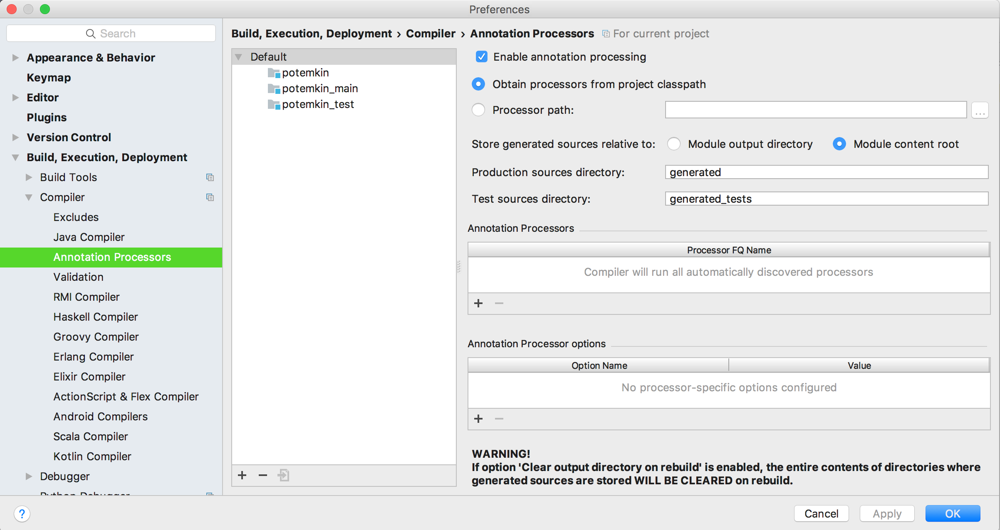

# Potemkin Faking Library

Named after [Prince Grigory Aleksandrovich Potemkin-Tavricheski](https://en.wikipedia.org/wiki/Grigory_Potemkin)'s [villages](https://en.wikipedia.org/wiki/Potemkin_village).

# Dependencies

* [Dagger2](https://google.github.io/dagger/)
* [Apache Ignite's HDFS](https://ignite.apache.org/use-cases/hadoop/hdfs-cache) (Optional)

# Test Dependencies

This project has the following test dependencies:

* [JUnit5](http://junit.org/junit5/)
* [Immutables](https://immutables.github.io/)
* [Java Faker](https://github.com/DiUS/java-faker)

# IntellliJ Idea Setup

This project uses Immutables in order to generate test example code. In order for it to compile correctly inside IntelliJ Idea 
you will need to enable annotation processing. Be sure to set the "Store generated sources relative to" flag to "Module Content Root".
 

